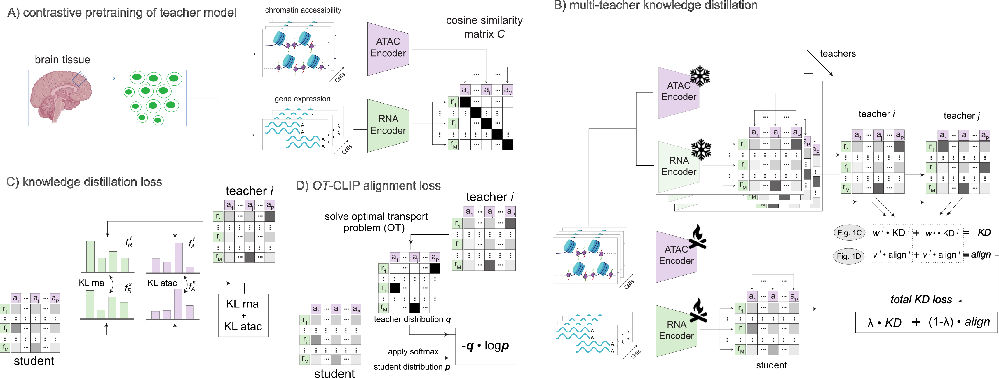

# `ECLARE`: multi-teacher contrastive learning via ensemble distillation for diagonal integration of single-cell multi-omic data

This repository is dedicated to <ins>**E**</ins>nsemble knowledge distillation for <ins>**C**</ins>ontrastive <ins>**L**</ins>earning of <ins>**A**</ins>TAC and <ins>**R**</ins>NA <ins>**E**</ins>mbeddings, a.k.a. `ECLARE` :zap::cake:.

The manuscript is currently available on [bioRxiv](https://doi.org/10.1101/2025.01.24.634799).

<details>
<summary>Installation</summary>

1. First, clone the repository:

    ```bash
    git clone https://github.com/li-lab-mcgill/ECLARE.git
    cd ECLARE
    ```

2. Create a virtual environment (use Python 3.9.6 for best reproducibility):
    ```bash
    python -m venv eclare_env
    ```

3. Activate the virtual environment
    
    Windows
    ```bash
    eclare_env\Scripts\activate
    ```
    
    macOS and Linux
    ```bash 
    source eclare_env/bin/activate
    ```

    Git Bash on Windows
    ```bash
    source eclare_env/Scripts/activate
    ```

4. Install the package:
    For standard installation:
    ```bash
    pip install .
    ```

    For editable installation (recommended for development):
    ```bash
    pip install -e .
    ```
</details>

<details>
<summary>Configuration</summary>

Before running the application, you need to set up your configuration file. Follow these steps:

1. Copy the template configuration file:

    ```bash
    cp config/config_template.yaml config/config.yaml
    ```

2. Edit `config.yaml` to suit your environment. Update paths and settings as necessary:

    ```yaml
    active_environment: "local_directories"

    local_directories:
      outpath: "/your/custom/output/path"
      datapath: "/your/custom/data/path"
    ```
</details>

<details>
<summary>Requirements</summary>

- Python ≥ 3.9 (3.9.6 for best reproducibility)
- See `setup.py` for a complete list of dependencies
</details>

<details>
<summary>Overview of ECLARE framework</summary>

---


ECLARE (Ensemble knowledge distillation for Contrastive Learning of ATAC and RNA Embeddings) is a framework designed to integrate single-cell multi-omic data, specifically scRNA-seq and scATAC-seq data, through these key components:

1. **Multi-Teacher Knowledge Distillation**:
   - Multiple teacher models are trained on paired datasets (where RNA and ATAC data are available for the same cells)
   - These teachers then guide a student model that works with unpaired data
   - This approach helps transfer knowledge from well-understood paired samples to situations where only unpaired data is available

2. **Contrastive Learning**:
   - Uses a refined contrastive learning objective to learn representations of both RNA and ATAC data
   - Helps align features across different modalities (RNA and ATAC)
   - Enables the model to understand relationships between different data types

3. **Transport-based Loss**:
   - Implements a transport-based loss function for precise alignment between RNA and ATAC modalities
   - Helps ensure that the learned representations are biologically meaningful

The framework is particularly valuable because it:
- Addresses the common problem of limited paired multi-omic data
- Enables integration of unpaired data through knowledge transfer
- Preserves biological structure in the integrated data
- Facilitates downstream analyses like gene regulatory network inference

---

Figure 1 from manuscript: Overview of ECLARE

<div style="display: flex; justify-content: center; margin: 20px;">
  <div style="background: white; padding: 20px; border-radius: 8px;">
    
  </div>
</div>
</details>

<details>
<summary>Manuscript figure/code map</summary>

Main figures:

1. Figure 1 (overview schematic)
   - Core model/losses: `src/eclare/models.py`, `src/eclare/losses_and_distances_utils.py`
   - Training loop + orchestration: `src/eclare/run_utils.py`, `scripts/eclare_scripts/eclare_run.py`

2. Figure 2 (benchmarking metrics; paired + unpaired MDD)
   - ECLARE/KD-CLIP/CLIP training: `scripts/eclare_scripts/eclare_run.py`, `scripts/kd_clip_scripts`, `scripts/clip_scripts/clip_run.py`
   - Baselines: `scripts/benchmark_diagonal`, `scripts/benchmark_vertical`
   - Metrics + plots: `src/eclare/eval_utils.py`, `scripts/plot_figures.py`

3. Figure 3 (MDD embeddings + enrichment + GRN subnetwork)
   - MDD embedding + enrichment: `scripts/enrichment_analyses.py`
   - Enrichment plotting: `scripts/enrichment_plots.py`
   - GREAT validation: `scripts/rGREAT_analysis.R`

4. Figure 4 (developmental integration)
   - ECLARE developmental analysis: `scripts/developmental_post_hoc.py`
   - Ordinal pseudotime + DPT: `scripts/ordinal_post_hoc.py`
   - SCENIC+ eRegulon scoring: `scripts/scenicplus_post_hoc.py`

5. Figure 5 (longitudinal MDD co-embedding)
   - Co-embedding, label transfer, PAGA: `scripts/developmental_post_hoc.py`
   - Ordinal model training: `scripts/ordinal_scripts/ordinal_run.py`
   - DE + EnrichR for longitudinal hits: `scripts/pydeseq2_developmental_analysis.py`, `scripts/enrichment_plots.py`

Supplementary figures:

1. Figure S1 (Brain.GMT enrichment, sc-compReg vs pyDESeq2)
   - `scripts/enrichment_analyses.py`, `scripts/enrichment_plots.py`

2. Figure S2 (GREAT enrichment)
   - `scripts/rGREAT_analysis.R`, `scripts/enrichment_plots.py`

3. Figure S3 (H-MAGMA enrichment)
   - `scripts/enrichment_analyses.py`, `scripts/enrichment_plots.py`

4. Figure S4 (module-score DE for Brain.GMT sets)
   - `scripts/enrichment_analyses.py`, `scripts/enrichment_plots.py`

5. Figure S5 (ABHD17B external expression evidence)
   - External sources (GTEx/psychSCREEN); no generation script in this repo

6. Figure S6 (ECLARE vs scJoint vs GLUE embeddings with DPT)
   - ECLARE: `scripts/developmental_post_hoc.py`
   - scJoint: `scripts/benchmark_diagonal/scJoint/scJoint_latents.py`
   - GLUE: `scripts/benchmark_vertical/glue/glue_latents.py`

7. Figure S7 (CORAL ordinal embeddings: PFC_V1_Wang -> Cortex_Velmeshev)
   - `scripts/ordinal_post_hoc.py`, `scripts/ordinal_scripts/ordinal_run.py`

8. Figure S8 (Velmeshev density in ECLARE embedding)
   - `scripts/developmental_post_hoc.py`

9. Figure S9 (CORAL ordinal embeddings: PFC_Zhu -> MDD)
   - `scripts/ordinal_post_hoc.py`, `scripts/ordinal_scripts/ordinal_run.py`

10. Figure S10 (balancing donor age by modality/condition)
    - `scripts/developmental_post_hoc.py`

11. Figure S11 (co-embedding density: PFC_Zhu vs MDD)
    - `scripts/developmental_post_hoc.py`

12. Figure S12 (male-specific pseudotime branch analysis)
    - `scripts/developmental_post_hoc.py`

13. Figure S13 (pseudotemporal gene clusters)
    - `scripts/cluster_dev_genes_by_km.py`

14. Figure S14 (EnrichR for km3_mdd + EGR1 regulon overlap)
    - `scripts/pydeseq2_developmental_analysis.py`, `scripts/enrichment_plots.py`

15. Figure S15 (pychromVAR differential accessibility)
    - `scripts/pydeseq2_developmental_analysis.py`

16. Figure S16 (EGR1 eRegulon scores, male donors)
    - `scripts/developmental_post_hoc.py`, `scripts/scenicplus_post_hoc.py`

</details>

<details>
<summary>Demo: analysis on sample paired datasets</summary>


We provide a demo notebook `sample_analysis.ipynb` to analyze the sample paired datasets.

This analysis is based on using DLPFC_Anderson and DLPFC_Ma as source datasets and PFC_Zhu as target dataset. See Table 1 in the [manuscript](https://www.biorxiv.org/content/10.1101/2024.01.22.576482) for more details about datasets.

Sample data is available from Zenodo at https://doi.org/10.5281/zenodo.14794845. Instructions for downloading the data are available in the notebook.

</details>
